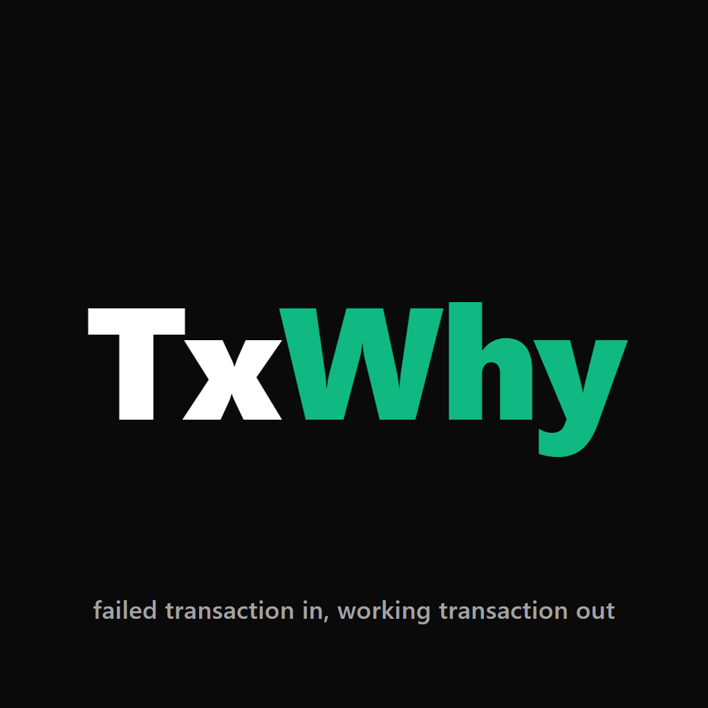
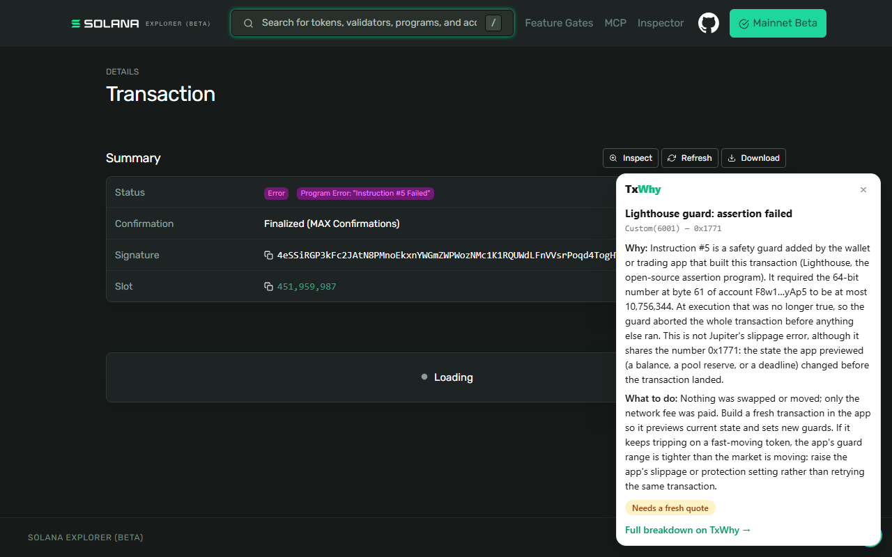

# TxWhy

[](https://github.com/SUNDRAM07/txwhy/actions/workflows/ci.yml) [](https://www.npmjs.com/package/@txwhy/sdk) [](https://crates.io/crates/txwhy-verify)

**Failed transaction in. Working transaction out.**

TxWhy finds the exact reason a Solana transaction failed, rebuilds it, and proves the rebuilt one works by simulating it against live mainnet state. It returns the fix unsigned, so your keys never leave your machine.

- Live: **https://txwhy.vercel.app**
- For agents (MCP): `https://txwhy.vercel.app/api/mcp`
- Telegram: **[@txwhy_bot](https://t.me/txwhy_bot)** (try `/demo`)
  In a private chat, `/watch <address>` makes the bot message you the moment a transaction from that wallet fails, with the cause and the fix (up to 3 wallets, 5 alerts an hour each; `/unwatch` deletes it).
- Usage, in the open: https://txwhy.vercel.app/stats
- Every claim with its one-click check: https://txwhy.vercel.app/proof

## Why

Somewhere between one in eight and one in two Solana transactions fail on a busy day. Bots and agents fail more than half of what they send, and the priority fee is burned every time. What comes back is a code like `Custom(6001)`.

Explorers and AI explainers tell you what happened. Nothing hands you the transaction that works. That is the gap TxWhy fills, and it matters most inside an automated send loop, where nobody is around to read an explanation.

Most failures never reach the chain. Wallets and agents simulate first, and the transaction dies there. So the core flow is not "paste an old signature". It is:

> Your transaction just failed simulation. Hand it to TxWhy. Get back one that passes, typically in under a second.

## One line, any dApp or wallet

```ts
import { withRepair } from "@txwhy/sdk/wallet";

const { signature, repairs } = await withRepair(wallet, connection).sendTransaction(tx);
```

`wallet` is whatever `useWallet()` gives you (Phantom, Solflare, Backpack) or `window.solana`. The transaction is simulated; if it would fail, TxWhy rebuilds it, the repair is verified locally against the original, and only then is the wallet asked to sign, once, for the transaction that lands. Bots and agents use `sendWithRepair` with their own keypair; the same loop exists for @solana/kit and for Python.

## What it fixes

| Failure | What TxWhy does |
|---|---|
| Blockhash expired | Replaces it, after checking the original had really expired |
| Compute budget exceeded | Runs the transaction with the maximum budget, reads what it truly used, sets the limit to that plus 15% |
| Dropped under load | Sets the priority fee from what the network recently charged for the exact accounts written to. Never raises your total fee by more than 0.001 SOL, and falls back to your original fee if the wallet cannot afford more |
| Slippage on a Jupiter swap | Replaces **only** the swap instruction with a freshly quoted one. Tokens, amount, slippage tolerance and every other instruction (memos, fee transfers, tips) stay exactly as written. Shows how the minimum you receive changed |
| Loaded account data limit too small | Lifts a declared limit that is smaller than what the transaction loads |
| Slippage on a direct Pump.fun, PumpSwap, Raydium AMM v4, Meteora DBC, Meteora DAMM v2 or Raydium LaunchLab swap | These instructions carry no tolerance, only a limit (max cost or min output). The amount and every account stay as written; only the limit moves to the current price, read from the program's own failed check or from a simulation of the same transaction with the limit lifted, with a stated 1% tolerance and never more than 25% against you. Swaps routed through another program by CPI are explained, not touched |
| Version 1 transaction (SIMD-0385) | Same repairs, applied to the header config instead of instructions; re-encoded with @solana/kit 8. `npx tsx scripts/test-v1.ts` covers it |

And what it refuses to fake:

| Failure | What TxWhy says instead |
|---|---|
| Not enough SOL, or not enough tokens to sell | The exact shortfall: what the account holds, what the swap needs, in SOL or in the token's units |
| A buy bigger than what is left on a Meteora DBC launch pool | The exact room left before the pool graduates, what the buy puts in, and the Meteora DAMM v2 pool the token moves to, read from the pool's own account. A graduated pool gets the same answer with its new pool address |
| A program rejected it | The named error, cause and fix from 1,874 bundled errors across 37 programs, plus any IDL the program published on chain |
| A private program rejected it | Which program raised the code, and that only its authors can decode it |
| Circular arbitrage that missed its gap | That it is built to fail this way and there is nothing to repair |

A rebuilt transaction is only ever returned if it passes simulation. TxWhy will not hand back something that would fail again.

## Self-host

The API, the site and the worker run anywhere Docker runs, in your own region, next to your own RPC.

```bash
docker build -t txwhy . && docker run -p 3000:3000 -e SOLANA_RPC_URL=https://your-rpc txwhy
# or the whole thing, with your own failure index and Redis:
SOLANA_RPC_URL=https://your-rpc docker compose up --build
```

Only `SOLANA_RPC_URL` is required. Optional: `SOLANA_RPC_FALLBACK_URL`; `JUPITER_API_KEY` and `JUPITER_API_BASE` for a paid Jupiter tier; `WORKER_URL` and `WORKER_SECRET` to attach the worker (global rate limits, /failures, /stats); `STATS_SALT` for hashed usage counters; `TELEGRAM_BOT_TOKEN` and `TELEGRAM_WEBHOOK_SECRET` for the bot; `X402_PAY_TO` for pay-per-repair. Nothing is phoned home: a self-hosted TxWhy never contacts txwhy.vercel.app.

## How it works

1. **Diagnose.** Fetch or simulate the transaction, build the full instruction and CPI tree, and find the exact failing call by replaying the runtime's own `invoke` / `success` / `failed` log lines.
2. **Name it.** Decode the error through four layers: the runtime's own errors, the program's on-chain Anchor IDL, bundled error tables for major programs, and the System and Token program enums.
3. **Rebuild.** Decompile the message (resolving address lookup tables), apply the repair that matches the cause, and leave everything else untouched.
4. **Prove.** Simulate the rebuilt transaction with `sigVerify: false` against current state. Return it unsigned only if it passes.

## Use it

### npm, one line in your send loop

```bash
npm i @txwhy/sdk
```

```ts
import { sendWithRepair } from "@txwhy/sdk";
const { signature, repairs } = await sendWithRepair(connection, tx, (t) => wallet.signTransaction(t));
```

Simulates on your RPC; if it passes, sends and never contacts TxWhy. If it would fail: repair, verify the repair locally, sign, send. Also `repair()`, `verifyRepair()`, and `npx txwhy <signature>`. `@txwhy/sdk/kit` is the same loop for @solana/kit users with no web3.js, and the way to send version 1 transactions. Package docs: [sdk/README.md](sdk/README.md).

### REST

```bash
curl -X POST https://txwhy.vercel.app/api/v1/repair \
  -H "content-type: application/json" \
  -d '{"transaction": "<base64, signed or unsigned>"}'
```

Pass `{"signature": "..."}` instead for a transaction that already landed and failed.

```json
{
  "status": "repaired",
  "summary": "Repaired. 2 changes applied and the rebuilt transaction passes simulation.",
  "cause": { "title": "Compute budget exceeded", "code": "...", "cause": "...", "fix": "..." },
  "changes": [
    { "type": "compute_unit_limit", "before": "100", "after": "518", "reason": "..." }
  ],
  "repairedTransaction": "<base64, unsigned>",
  "simulation": { "passed": true, "unitsConsumed": 450, "error": null, "logsTail": ["..."] },
  "notes": ["..."]
}
```

`status` is one of `repaired`, `valid`, `needs_requote`, `not_repairable`. Whenever a transaction is returned, `verification` carries the instruction-level proof of what changed (see below).

### Pay per repair (x402)

`POST /api/x402/repair` is the same repair with no rate limit: $0.001 in USDC on Solana per call over [x402](https://x402.org), settled only after a successful answer, no account or API key. Example paying client: [sdk/examples/paid-repair.mjs](sdk/examples/paid-repair.mjs).

### MCP (any agent)

```json
{ "mcpServers": { "txwhy": { "url": "https://txwhy.vercel.app/api/mcp" } } }
```

Tools: `repair_transaction`, `diagnose_transaction`, `explain_error`. Stateless Streamable HTTP. No key, no account.

### Telegram

Message [@txwhy_bot](https://t.me/txwhy_bot) a signature, an explorer link, or a base64 transaction. In groups, use `/why <signature>` or reply to a message containing one with `/why`. `/demo` breaks a real swap and repairs it in the chat.

### Error code reference

[txwhy.vercel.app/errors](https://txwhy.vercel.app/errors): 1,934 published custom error codes across 40 programs, one page each, searchable by hex, decimal or name, generated from the same tables the decoder uses.

Paying agents can also find the endpoint on their own: it is listed in the [x402 Bazaar](https://facilitator.payai.network/discovery/resources), the facilitator's public catalog of paid services.

The failure index is also a free JSON API for anyone's research or dashboards: `GET https://txwhy.vercel.app/api/v1/index` (CC BY 4.0).

## Explain what you already have

A wallet or app that just watched a simulation fail already holds the answer's raw material: the `err` object and the logs. `POST /api/v1/explain` turns those into the same plain-words cause and fix, with wallet guards decoded when the failing instruction's bytes are included, and never sees the transaction. In the SDK: `explainError({ error, logs, instruction })`.

## In the explorer, where people actually land

[extension/](extension/) is a browser extension (Manifest V3, about 120 lines, no permissions beyond talking to txwhy.vercel.app). On any failed transaction page on Solscan, Solana Explorer, SolanaFM or Orb it shows the cause in plain words, what to do, and whether TxWhy can rebuild it, right where the explorer only shows `custom program error: 0x1771`. Load it unpacked from `chrome://extensions` until it is on the Web Store.



## What it explains when it cannot rebuild

Not every failure can be fixed by rebuilding, but every one gets the exact failing instruction, the program that raised it, the decoded error and what to do. One class worth naming: **wallet guards**. Wallets and trading apps append a Lighthouse assertion to abort a transaction when state changed since preview, and its error shares the number 0x1771 with Jupiter's slippage error, so explorers call it slippage. TxWhy decodes the guard instruction itself: "instruction #5 required the number at byte 61 of account F8w1…yAp5 to be at most 10,756,344", nothing was swapped, build a fresh transaction. Bare codes have their own pages too: [/errors/code/0x1771](https://txwhy.vercel.app/errors/code/0x1771) lists what a code means in every program.

## You never have to trust us

A service that hands you a transaction to sign could hand you anything. So the rule for what a repair may change is code you can run yourself, with no network access: same fee payer, same set of signers, every non-ComputeBudget instruction byte for byte in the same order, and at most one Jupiter swap replaced by one for the same wallet, same source and receiving token accounts, same output token, same amount and same slippage tolerance. It lives in [src/lib/verify.ts](src/lib/verify.ts), ships in the npm package as `verifyRepair` / `@txwhy/sdk/verify`, and the server runs it on its own output and refuses to return anything that fails it. `scripts/test-verify.ts` attacks it fifteen ways (extra transfer, redirected fee, new signer, widened slippage, proceeds redirected, layout switch); all are refused. Direct Pump.fun, PumpSwap, Raydium AMM v4, Raydium LaunchLab, Meteora DBC and Meteora DAMM v2 swaps may only have their limit moved, never more than 25% against the user; `scripts/test-verify.ts` covers eight more cases for those, nine for the Meteora swap modes and eight for the wrap rule. When a Meteora exact-output swap wraps exactly its maximum in SOL, that one wrap may rise with the maximum, by no more than the maximum rose and no more than 25% of the original wrap, and only into the swap's own input account.

The same rule also exists as a Rust crate with no Solana dependencies, [`txwhy-verify` on crates.io](https://crates.io/crates/txwhy-verify) (source in [crates/txwhy-verify](crates/txwhy-verify)), for Rust bots and programs that sign what TxWhy returns. Its `tests/parity.rs` replays real repairs produced by the live API (compute, Jupiter, PumpSwap, Raydium) and checks that the Rust and TypeScript verifiers reach the same verdict, then flips one byte in a real repair and checks it is refused.

And as a Python package, [`txwhy` on PyPI](https://pypi.org/project/txwhy/) (source in [python](python)): the same verifier in pure Python with no dependencies, `txwhy.repair()` / `txwhy.explain()`, and `txwhy.solana.async_send_with_repair()` for solana-py, which simulates, repairs, verifies locally, signs and sends. Its tests replay the same real-repair fixtures as the Rust crate, so the three verifiers are held to one truth.

## Run it locally

```bash
npm install
npm run dev                      # http://localhost:3000
```

Optional environment variables:

| Variable | Purpose |
|---|---|
| `SOLANA_RPC_URL` | Mainnet RPC endpoint. Defaults to the public one, which rate-limits hard |
| `JUPITER_API_BASE`, `JUPITER_API_KEY` | Jupiter swap API for slippage repair |
| `KV_REST_API_URL`, `KV_REST_API_TOKEN` | Upstash Redis for the public usage counters. Without it, counting is a silent no-op |
| `TELEGRAM_BOT_TOKEN`, `TELEGRAM_WEBHOOK_SECRET` | The Telegram bot |

## Tests

The tests run against a live server and live mainnet. They build deliberately broken unsigned transactions (simulation needs no keys), so they prove the real thing.

```bash
npm run dev -- -p 3111
node scripts/test-repair.mjs      # 7 repair scenarios, including a swap on a stale quote
node scripts/test-real.mjs        # real failed transactions pulled from mainnet
node scripts/test-slippage.mjs    # real slippage failures
node scripts/measure-naming.mjs   # how many real failures get a named cause
npx tsx scripts/test-verify.ts    # 29 verifier cases, most of them attacks; no network
npx tsx scripts/test-lighthouse.ts # 16 cases: Lighthouse guard instructions from real transactions decoded into plain words; no network
npx tsx scripts/test-pump.ts      # real Pump.fun / PumpSwap slippage failures: repaired, capped, or explained
npx tsx scripts/test-v1.ts        # 11 version-1 cases: header repairs, expired blockhash, stale Jupiter / PumpSwap / Raydium swaps, a real landed v1
npx tsx scripts/dbc-pool-verdict.ts # Meteora DBC pool-state verdicts on live mainnet: a graduated pool through the whole engine, the room-left figures on a live curve
cd sdk && node test.mjs           # the npm package end to end against production
node scripts/fuzz-repair.mjs      # 122 malformed, truncated, oversized and hostile inputs: never a 500, never a hang
node scripts/fuzz-mcp.mjs         # 52 malformed JSON-RPC calls and hostile tool arguments against the MCP server
node scripts/test-explain.mjs     # the explain endpoint on real err objects, logs and guard bytes from mainnet
node scripts/stress.mjs 24        # 24 simultaneous repairs against production: status mix and latency spread, no 5xx
node scripts/probe-ratelimit.mjs  # proves forged x-forwarded-for headers cannot dodge the per-IP limit
cd crates/txwhy-verify && cargo test   # 21 Rust verifier tests, incl. parity with real production repairs
cd python && PYTHONPATH=src python -m pytest   # the Python verifier: the same attack cases and the same parity fixtures
```

## What we learned from real data

- On a 25-transaction mainnet sample, every failure raised by a known program was named. The rest, about half, were raised by private trading programs that publish nothing.
- Of 30 slippage failures that landed on chain, 24 were circular arbitrage. Real users' slippage failures happen at simulation and never land, which is why the unsent-transaction path is the one that matters.
- A full repair, including a fresh Jupiter quote, takes about 0.6 seconds on the hosted service.

## Honest limits

- Version 1 transactions are diagnosed but not yet rebuilt. The standard Solana library cannot decode them yet.
- Slippage repair covers swaps where Jupiter is called at the top level. When the swap runs inside another program, the route cannot be replaced from outside it.
- Simulation proves the transaction executes now. It cannot guarantee inclusion if state changes before it lands.
- Rate limits are per server instance until shared storage is attached.

- **Version 1 transactions** (SIMD-0385, live on mainnet since Sep 15, 2026) are repaired natively: the compute settings (unit limit, priority fee in lamports, loaded-data limit) are edited in the header, a stale Jupiter swap is re-quoted the same way as in v0, and the rebuilt bytes are produced with @solana/kit 8. A v1 transaction with no loaded-data limit is budgeted zero bytes by the runtime; TxWhy sets it and says so. Routes needing more than 64 inline accounts cannot be carried by v1 and are reported as such.
- **Durable-nonce transactions** are supported: the nonce advance stays instruction 0 and the nonce account's current value is used; they are never reported as expired.
- **Size limit:** a legacy or v0 transaction already at the 1,232-byte limit has no room for a fee or limit instruction. TxWhy then keeps the original setting and says so, rather than returning something no node would accept.

## Stack

Next.js (App Router) and TypeScript on Vercel, `@solana/web3.js`, Jupiter swap API, `mcp-handler` for the MCP server, Upstash Redis for counters.

## Data attribution

`src/lib/data/program-errors.json` is extracted from the MIT-licensed [solana-idls](https://github.com/tenequm/solana-idls) dataset by tenequm. `src/lib/data/dex-labels.json` is Jupiter's public program label list. See `src/lib/data/ATTRIBUTION.md`.

## Development history

Built for Colosseum's Crypto World's Fair hackathon (Sep 14 to Oct 12, 2026), Solana track.

- **Before the hackathon window (Sep 1 to 2):** the transaction trace, the CPI tree, on-chain IDL decoding and a first error knowledge base. At that point TxWhy only explained failures.
- **Inside the window (from Sep 19):** the entire repair engine, slippage re-quoting, simulation proofs, the verifier and its attack suite, the bundled error tables and the 1,934 error-code pages, exact failure paths, the MCP server, the Telegram bot, the npm package and CLI, x402 pay-per-repair, the mainnet failure index worker, rate limiting, usage counters, link previews and the current site.

## License

MIT
